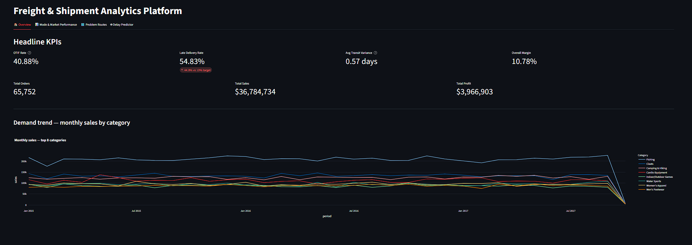
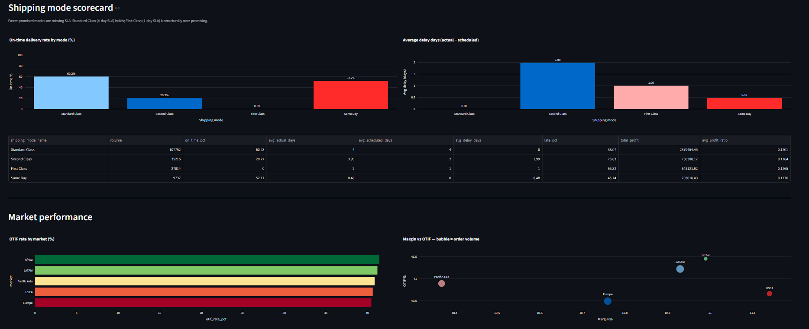
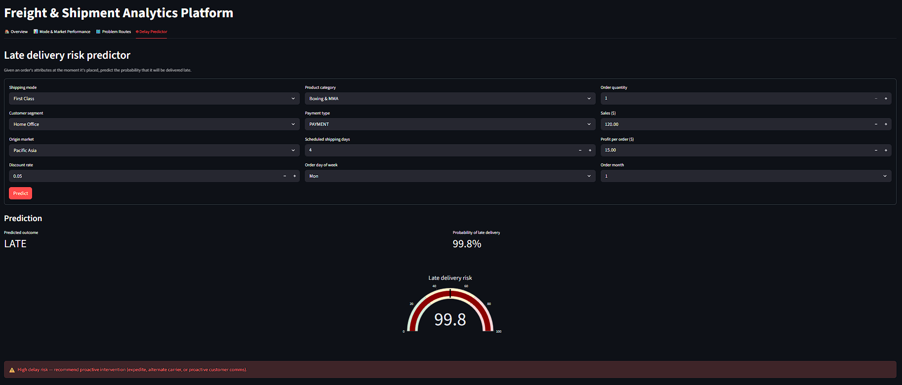
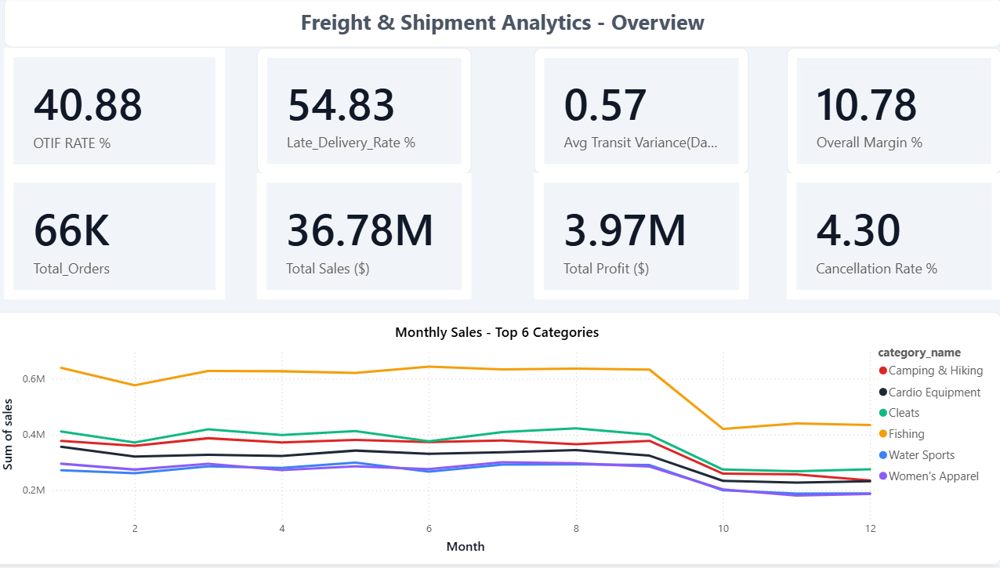
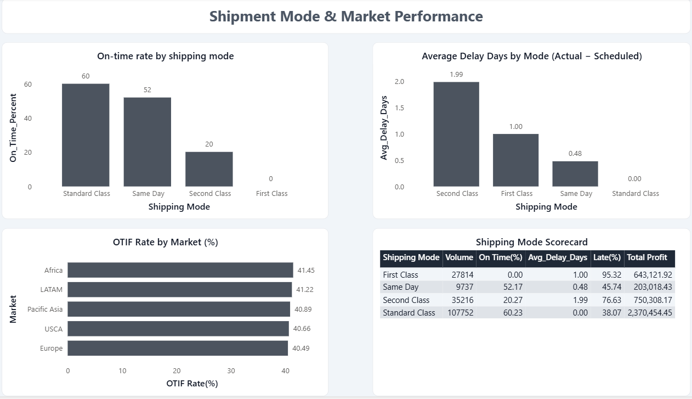
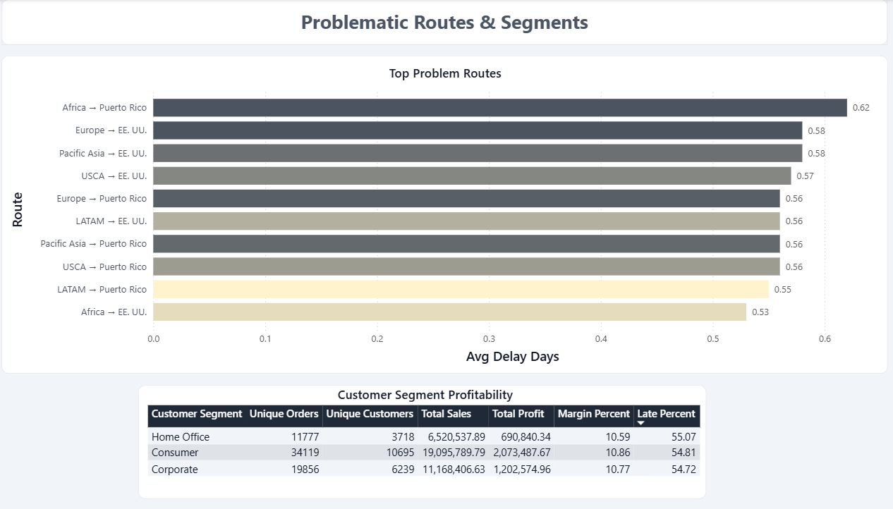

# Freight & Shipment Analytics Platform

> End-to-end supply chain analytics platform built for the freight forwarding and 3PL domain. Ingests global shipment data into a Kimball star schema warehouse, calculates supply chain KPIs (OTIF, transit variance, mode scorecard), predicts late deliveries with machine learning, and serves it through two dashboards: a deployed Streamlit web app and a Power BI report.

[](https://varad-supply-chain-analytics.streamlit.app/)
[](https://www.python.org/)
[](https://www.mysql.com/)
[](#power-bi-dashboard)
[](https://scikit-learn.org/)

**Live app:** <https://varad-supply-chain-analytics.streamlit.app/>



---

## What this is

DSV, DHL, Kuehne+Nagel, and every other global 3PL live and die by the same metrics: On-Time In-Full delivery, transit-time predictability, and cost-to-serve. This project mirrors the data products a Supply Chain Analyst would build in that environment, not a generic e-commerce dashboard.

The platform ingests 180,519 shipment records spanning five global markets (USCA, LATAM, Europe, Pacific Asia, Africa), models the data dimensionally so it's BI-tool ready, surfaces the headline operational KPIs as SQL views, adds a predictive layer to flag late-delivery risk before the SLA breach, and presents the results through both an interactive web dashboard (Streamlit) and a business-intelligence report (Power BI).

The Streamlit app is deployed publicly so you can click the link above and explore it yourself.

---

## Key findings

### The shipping mode paradox

The faster the promised delivery mode, the worse the on-time performance:

| Mode | SLA promise | Actual avg | On-time % | Late % | Volume |
|---|---|---|---|---|---|
| Standard Class | 4 days | 4.00 days | **60.2%** | 38.1% | 107,752 |
| Same Day | 0 days | 0.48 days | 52.2% | 45.7% | 9,737 |
| Second Class | 2 days | 3.99 days | 20.3% | 76.6% | 35,216 |
| First Class | 1 day | 2.00 days | **0.0%** | **95.3%** | 27,814 |

First Class shipments missed SLA on every single one of 27,814 orders. This isn't a logistics failure. It's a structural SLA misalignment. The physical network can reliably deliver in 2 to 4 days, while the company keeps selling 1-day delivery. The corrective action is commercial (reset SLA), not operational.

### Systemic, not regional or segment-specific

The OTIF rate sits between 40.49% and 41.45% across all five global markets, a spread of less than one percentage point. Customer-segment late percentages are equally uniform (54.72% to 55.07%). When the problem is uniform across markets and customer types, the cause is upstream of operations, in how SLAs are set at the policy level, not in regional execution.

### Network health

* OTIF rate: 40.88%, far below the 90%+ industry benchmark for healthy 3PLs
* Late delivery rate: 54.83%, more orders are late than on-time
* Late-delivery classifier (at the recommended operational threshold of 0.30): 98.7% recall on late shipments, so operations can proactively expedite virtually every late order

---

## Architecture

```
┌────────────────┐   ┌──────────────┐   ┌──────────────────┐   ┌─────────────┐
│  Raw CSV       │──▶│  Python      │──▶│  MySQL 8.0       │──▶│  SQL Views  │
│  (180k orders) │   │  Ingestion   │   │  (Star Schema)   │   │  (KPIs)     │
└────────────────┘   └──────────────┘   └──────────────────┘   └──────┬──────┘
                                                                       │
              ┌────────────────────────────────────────────────────────┤
              ▼                                                        ▼
     ┌─────────────────┐                                  ┌──────────────────────┐
     │  scikit-learn   │                                  │  Dashboards          │
     │  Delay Predictor│─────────────────────────────────▶│  Streamlit + PowerBI │
     └─────────────────┘                                  └──────────┬───────────┘
                                                                     │
                                                                     ▼
                                                          ┌─────────────────────┐
                                                          │  Streamlit Cloud    │
                                                          │  (Public Live URL)  │
                                                          └─────────────────────┘
```

**Data model**: Kimball star schema. One fact (`fact_orders`, 180,519 rows) and five conformed dimensions (`dim_customer`, `dim_product`, `dim_geography`, `dim_shipping_mode`, `dim_date`).

**Production pattern**: in development the Streamlit app reads live from MySQL; for the public deployment, view results are materialized to parquet (`data/snapshot/`) and the app switches to file mode via the `USE_SNAPSHOT` flag, keeping the demo self-contained.

---

## Tech stack

| Layer | Tool | Why this choice |
|---|---|---|
| Warehouse | MySQL 8.0 (Docker) | OLTP standard, what most 3PLs already run on |
| Ingestion | Python, pandas, SQLAlchemy, PyMySQL | Production-standard analyst toolchain |
| Modeling | Kimball star schema | Universal pattern that maps directly to BI consumption |
| ML | scikit-learn (LogReg + HistGradientBoosting) | Linear baseline compared against gradient boosting |
| Dashboards | Streamlit + Plotly *and* Power BI | Web-app for live demo; Power BI for the enterprise BI story |
| Deployment | Streamlit Community Cloud + GitHub | Live public URL with zero infra cost |

---

## KPIs implemented

| KPI | Definition | Business meaning |
|---|---|---|
| OTIF rate | % delivered on time AND not cancelled | Headline supply chain KPI |
| Avg transit variance | AVG(actual − scheduled days) | Network predictability |
| Late delivery rate | % of orders with status 'Late delivery' | Direct customer impact |
| Shipping mode scorecard | On-time %, avg delay, volume by mode | Capacity and SLA reset signal |
| Market performance | OTIF + margin by global market | Regional ops health |
| Top problem routes | Worst origin to destination pairs | Targeted fix list |
| Segment profitability | Margin + late % by customer type | Cost-to-serve insight |
| Predicted delay risk | ML model probability per order | Proactive intervention signal |

---

## Streamlit dashboard (live demo)

The web app at <https://varad-supply-chain-analytics.streamlit.app/> has four tabs: overview, mode and market performance, problem routes, and a live ML delay predictor.

### Overview, headline KPIs at a glance


### Mode and Market Performance, the shipping mode paradox visualized


### Late Delivery Predictor, live ML inference


---

## Power BI dashboard

A native Power BI report built on the same MySQL warehouse. Three pages covering the same KPI surface, designed for the enterprise BI environment most 3PLs run on. The `.pbix` file (`supply_chain_dashboard.pbix`) is committed in this repo. Download and open it with Power BI Desktop to explore interactively.

### Overview page, KPIs and demand trends


### Mode and Market Performance, the shipping mode story


### Routes and Segments, problem routes and customer segment profitability


---

## Repository structure

```
supply-chain-analytics/
├── data/
│   ├── raw/                    # DataCoSupplyChainDataset.csv (gitignored, 95 MB)
│   └── snapshot/               # Parquet snapshots for the live deployment
├── sql/
│   ├── ddl/                    # Star schema definition (MySQL)
│   └── analytics/              # KPI view definitions
├── src/
│   ├── db.py                   # SQLAlchemy engine factory
│   ├── ingestion/
│   │   └── load_data.py        # CSV to MySQL pipeline
│   ├── models/
│   │   ├── train.py            # Trains LR + GBM with class balancing
│   │   ├── analyze_model.py    # Threshold + cost + feature-importance analysis
│   │   ├── late_delivery_classifier.joblib
│   │   └── model_metrics.txt
│   └── dashboard/
│       ├── app.py              # Streamlit application
│       └── snapshot.py         # Exports view results to parquet for deployment
├── supply_chain_dashboard.pbix # Power BI report
├── docker-compose.yml          # Local MySQL container
└── requirements.txt
```

---

## Local setup

### Prerequisites
* Python 3.10+ (3.13 recommended)
* Docker Desktop
* MySQL Workbench (for SQL inspection)
* Power BI Desktop (Windows only, for the .pbix)
* The Kaggle dataset CSV: <https://www.kaggle.com/datasets/shashwatwork/dataco-smart-supply-chain-for-big-data-analysis>

### Get running in 10 minutes

```bash
# 1. Python environment
python -m venv venv
venv\Scripts\activate          # Windows
pip install -r requirements.txt
cp .env.example .env

# 2. Start MySQL
docker compose up -d

# 3. Drop the Kaggle CSV into data/raw/, then:

# 4. Create the schema (in MySQL Workbench): sql/ddl/01_schema.sql

# 5. Load 180k rows into the warehouse
python src/ingestion/load_data.py

# 6. Build the KPI views (in MySQL Workbench): sql/analytics/kpis.sql

# 7. Train the classifier
python src/models/train.py

# 8. (Optional) Run the full model analysis (threshold + feature importance)
python src/models/analyze_model.py

# 9. Launch the Streamlit dashboard
streamlit run src/dashboard/app.py

# 10. (Optional) Open the Power BI report
#     File > Open > supply_chain_dashboard.pbix
```

---

## ML model details

Binary classifier predicting `delivery_status = 'Late delivery'` from order attributes available at order placement.

**Features** (15 total): shipping mode, customer segment, product category, origin market, payment type, scheduled days, item quantity, sales, profit, discount rate, discount amount, day-of-week, month, quarter, and `is_international` (origin market different from destination market). Both numeric and one-hot-encoded categorical features go through a single `sklearn.Pipeline` with `StandardScaler` and `OneHotEncoder`.

**Models compared**: Logistic Regression (linear baseline) versus HistGradientBoostingClassifier (champion). Both trained with `class_weight='balanced'` to push recall on the "late" class.

### Threshold tuning

The default 0.5 decision threshold gives high precision (~89%) but mediocre recall (~54%). A threshold sweep from 0.20 to 0.80 produced this picture:

| Threshold | Precision | Recall | F1 |
|---|---|---|---|
| 0.30 | 57.8% | **98.7%** | 0.729 |
| 0.50 (default) | 88.9% | 54.0% | 0.672 |
| 0.70 | 89.5% | 52.7% | 0.663 |

**Cost-optimal threshold under assumed cost structure** ($25 per false alarm, $150 per missed late delivery): 0.22. However, at this cutoff the model flags nearly every order, which is a degenerate solution that doesn't really use the model's discrimination.

**Recommended operational threshold: 0.30.** Captures 98.7% of late deliveries while still meaningfully discriminating between orders. The principle: threshold tuning is only as good as the cost assumptions, and those belong to operations to validate.

### Feature importance (permutation, scoring=ROC-AUC)

Top features driving model performance:

1. **shipping_mode_name** at 0.0821 (dominant)
2. **days_for_shipping_scheduled** at 0.0463
3. payment_type at 0.0034
4. order_month at 0.0028
5. customer_segment at 0.0027

Two features (shipping mode + scheduled days) explain roughly 95% of the model's predictive performance.

### The honest negative finding

The two features engineered specifically in Phase 6 (`is_international` and `order_quarter`) both showed **near-zero importance**. The hypothesis that geography or seasonality would add predictive signal was wrong, and that's a valuable finding:

* Late delivery isn't a geography problem (`is_international` doesn't matter, consistent with OTIF being uniform across all five markets)
* Late delivery isn't a seasonality problem (`order_quarter` doesn't matter)
* It's a structural SLA problem, confirmed from multiple angles

To meaningfully improve performance, the model would need data the warehouse doesn't have: carrier identity, weather, port congestion, customs delays. That's the natural next direction.

---

## Roadmap

* [x] **Phase 1**: MySQL warehouse with Kimball star schema + KPI views
* [x] **Phase 2**: Late delivery classifier (scikit-learn)
* [x] **Phase 3**: Streamlit dashboard with live ML predictor
* [x] **Phase 4**: Public deployment on Streamlit Community Cloud
* [x] **Phase 5**: Power BI dashboard (.pbix) connecting to the warehouse
* [x] **Phase 6**: Feature engineering, class balancing, threshold + cost analysis, feature importance
* [ ] **Phase 7**: External data integration (carrier identity, weather, distance) for harder predictive lift
* [ ] **Phase 8**: Productionize transformations with dbt

---

## Data

**DataCo Smart Supply Chain** dataset on Kaggle. 180,519 orders across 5 global markets, 4 shipping modes, ~50 product categories. <https://www.kaggle.com/datasets/shashwatwork/dataco-smart-supply-chain-for-big-data-analysis>
